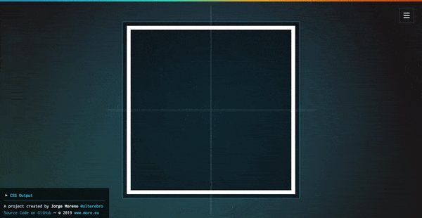

# css-transform &rsaquo; [css-transform.moro.es](https://css-transform.moro.es/)

**CSS3 Transform Functions Playground**. Demo UI built with [Vue](https://vuejs.org/), [Gulp](https://gulpjs.com/) and [LESS](http://lesscss.org/). Deployment via [Netlify](https://www.netlify.com/)

[](https://www.netlify.com/)



---

## Development

### &mdash; Install

Clone or [download](https://github.com/alterebro/css-transform/archive/master.zip) the repository and install dependencies

```sh
$ git clone https://github.com/alterebro/css-transform.git
$ cd css-transform/
$ npm install
```

### &mdash; Serve

Start a local server, i.e the `SimpleHTTPServer` python module

```sh
$ python -m SimpleHTTPServer <port>

# Source    : http://0.0.0.0:8000/src/
# Compiled  : http://0.0.0.0:8000/dist/
```

### &mdash; Build

Using *gulp* to compile the project

```sh
$ npm install gulp-cli -g # In case gulp isn't already installed
$ gulp build
```

---

*Jorge Moreno &mdash; [@alterebro](https://twitter.com/alterebro)*
